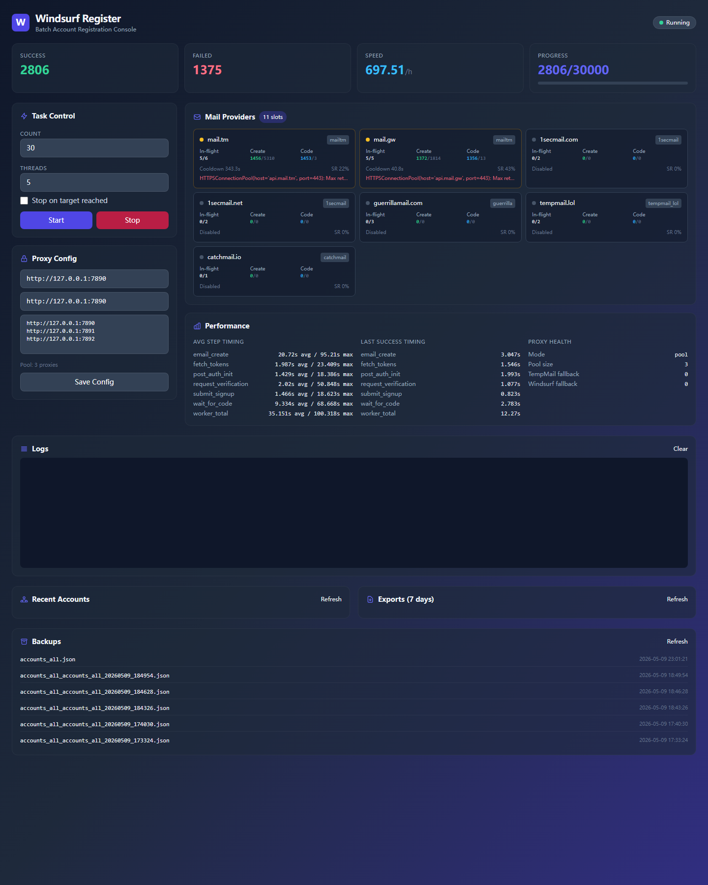
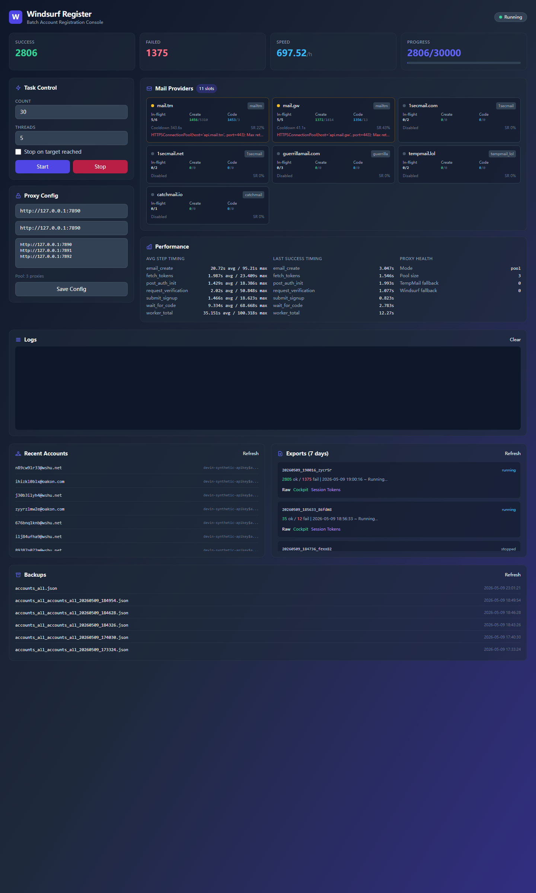
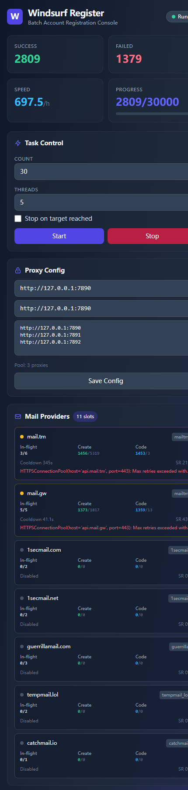

# Windsurf Register（中文说明）

一个基于 Flask 的批量任务面板，支持并发运行、代理池轮换、邮箱源健康诊断和结果导出。

[English](README.md) | 简体中文

## 界面预览

桌面总览：



桌面完整视图：



移动端视图：



## 功能

- 通过 Web 页面启动和停止任务
- 按可配置并发运行
- 支持代理池轮换
- 跟踪邮箱源健康状态、阶段耗时和回退次数
- 支持多种导出格式（`raw`、`custom`、`session`）
- 通过 `config.json` 保存运行配置

## 目录结构

```text
WindsurfRegister_Deploy/
  server.py                 # Flask 服务入口（5000 端口）
  templates/index.html      # 前端页面
  requirements.txt          # Python 依赖
  start.sh                  # Linux 启动脚本
  start.bat                 # Windows 启动脚本
  config.example.json       # 配置模板
  assets/screenshots/       # README 预览图
  task_exports/             # 导出文件
  backups/                  # 备份文件
```

## 快速开始

1. 创建并激活虚拟环境

```bash
python -m venv .venv
source .venv/bin/activate
```

Windows PowerShell：

```powershell
.\.venv\Scripts\Activate.ps1
```

2. 安装依赖

```bash
pip install -r requirements.txt
```

3. 初始化配置

```bash
cp config.example.json config.json
```

Windows PowerShell：

```powershell
Copy-Item .\config.example.json .\config.json
```

4. 启动服务

```bash
python server.py
```

默认访问地址：

- `http://127.0.0.1:5000`

## 主要接口

- `GET /` - 首页
- `GET /status` - 运行状态和增量日志
- `GET /providers` - 临时邮箱源健康状态和统计
- `POST /start_batch` - 启动任务
- `POST /stop` - 停止任务
- `GET /accounts` - 当前/最近任务结果
- `GET /exports` - 最近导出列表
- `GET /download?format=raw|custom|session` - 下载最近导出
- `POST /config` 和 `GET /config` - 更新/读取配置

## 数据安全说明

- `config.json` 可能包含本地代理信息，默认已被 Git 忽略
- `accounts*.json` 和 `cockpit_direct_import*.json` 可能包含敏感数据，默认已被 Git 忽略
- 不要提交真实账号、令牌或私有代理信息

## 友链

- [Linux.do](https://linux.do/)
